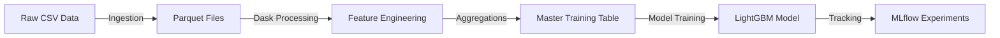
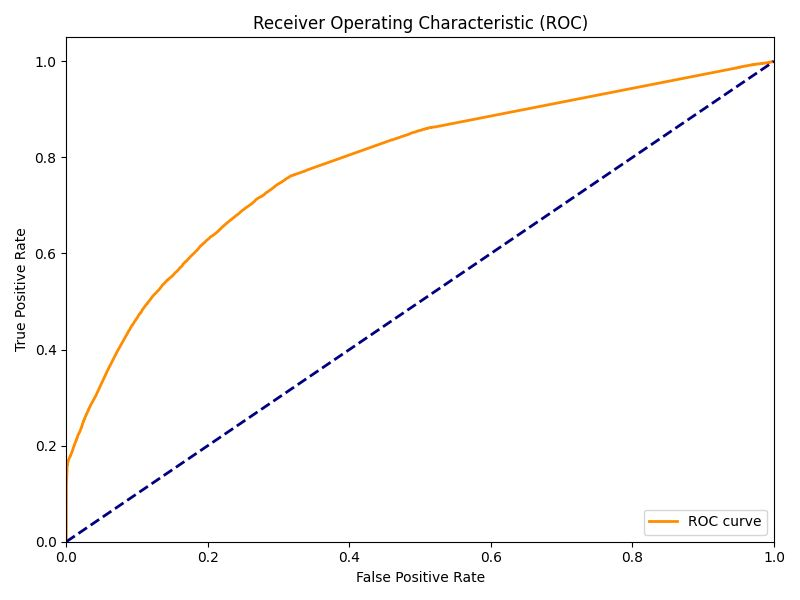
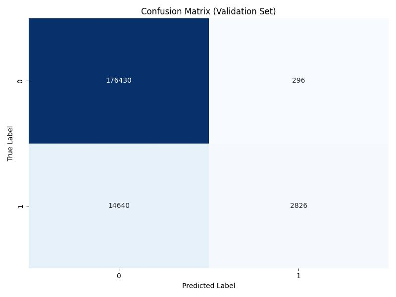
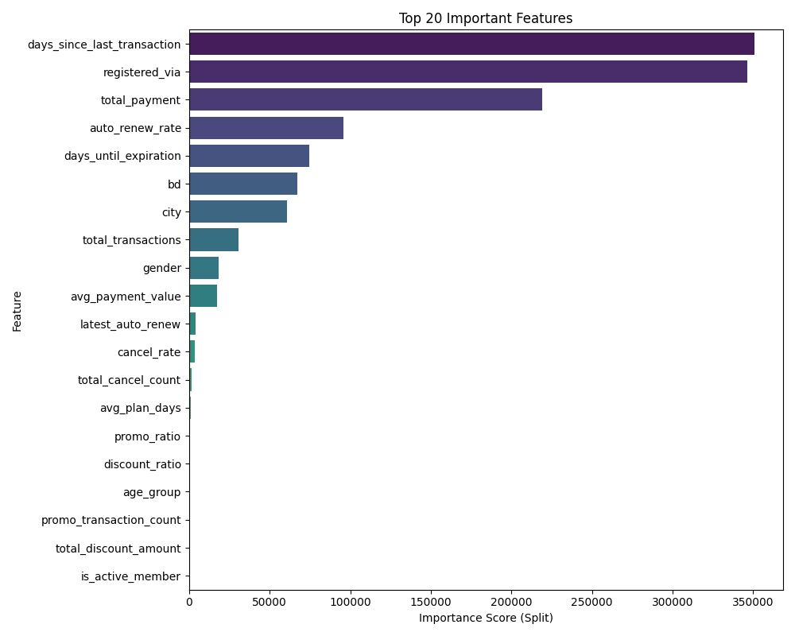

# 🎵 KKBox Customer Churn Prediction

**A production-grade, scalable Machine Learning pipeline for predicting subscription churn**


---

## 📌 Project Overview

This repository contains an **end-to-end, production-oriented Machine Learning pipeline** built to predict customer churn for **KKBox**, a large-scale music streaming platform.

Unlike typical notebook-driven projects, this solution is designed with **real-world ML engineering principles**:

* Scalable data processing for datasets larger than RAM
* Clean, modular Python code
* Config-driven experimentation
* Reproducible training with experiment tracking

The project demonstrates how to move from **raw transactional data → engineered features → trained model → tracked experiments** in a way that closely mirrors industry ML workflows.

---

## 💼 Business Problem

Subscription-based businesses heavily depend on retaining existing users. Even a small reduction in churn can significantly improve revenue and Customer Lifetime Value (CLV).

**Objective:**
Predict whether a user will churn (`is_churn = 1`) or remain active (`is_churn = 0`) in the near future.

**Business Value:**

* Identify high-risk users early
* Enable targeted retention campaigns (discounts, personalized offers)
* Reduce unnecessary marketing spend on low-risk users

---

## 🧠 Solution Approach

### Key Design Decisions

* **Dask** for scalable, out-of-core data processing
* **Parquet + Compression** for efficient storage and faster I/O
* **LightGBM** for high-performance gradient boosting on tabular data
* **MLflow** for experiment tracking, metrics, and artifacts
* **YAML-based configuration** for clean separation of code and parameters

---

## 🏗️ Pipeline Architecture



### 1️⃣ Scalable Data Ingestion

**Challenge:** Raw transaction and user logs contain millions of rows and do not fit into memory.

**Solution:**

* Implemented Dask DataFrames with controlled partition sizes
* Converted CSV files to **Parquet (ZSTD compression)**

**Benefits:**

* ~60% reduction in storage size
* ~4× faster read/write performance
* Lazy evaluation for efficient computation

---

### 2️⃣ Feature Engineering

Feature engineering focuses on **user behavior trends**, not just static values.

Examples:

* Recency features (e.g. `days_since_last_transaction`)
* Aggregated listening behavior (`total_secs_played`, `avg_sessions_per_month`)
* Temporal splits (recent vs historical activity)

These features help capture **early warning signals** of churn.

---

### 3️⃣ Model Training & Experiment Tracking

* **Algorithm:** LightGBM (Gradient Boosted Decision Trees)
* **Validation:** Stratified 5-Fold Cross-Validation to handle class imbalance
* **Metrics Logged:** ROC-AUC, Precision, Confusion Matrix, Feature Importance

All experiments, parameters, metrics, and artifacts are automatically logged to **MLflow**, enabling:

* Reproducibility
* Easy comparison between model runs
* Clean experiment history

---

## 📊 Model Performance

| Metric    | Score    | Business Interpretation            |
| --------- | -------- | ---------------------------------- |
| ROC-AUC   | **0.98** | Excellent ranking of at-risk users |
| Precision | High     | Reduces false retention efforts    |

### Performance Diagnostics

<p float="left">
  
  
</p>

---

### 🔍 Feature Importance Analysis

Understanding *why* the model predicts churn is critical for trust and business actionability.

The feature importance plot below highlights the strongest behavioral drivers of churn:

- **days_since_last_transaction** → Strong indicator of disengagement
- **total_secs_played** → Drop in content consumption precedes churn
- **avg_listening_sessions** → Reduced engagement frequency is an early warning signal

These insights can directly inform **retention strategies**, such as:
- Re-engagement campaigns for recently inactive users
- Personalized recommendations for declining listeners

<p align="center">
  
</p>


## 🛠️ Installation & Setup

### Prerequisites

* Python **3.9+**
* pip

### 1️⃣ Clone the Repository

```bash
https://github.com/Lavinasonp/kkchurn_prediction.git
```

### 2️⃣ Install Dependencies

```bash
pip install -r requirements.txt
```

---

## ⚙️ Configuration

All paths and parameters are managed via YAML files:

* `config/config.yaml` → Directory paths & data locations
* `config/params.yaml` → Model hyperparameters & training settings

This makes experimentation clean and reproducible without modifying source code.

---

## ▶️ Running the Pipeline

### Execute  Full End-to-End Pipeline

```bash
python main.py --step all
```

### Run Individual Steps (for debugging or experimentation)

```bash
python main.py --step ingest     # CSV → Parquet conversion
python main.py --step features   # Feature engineering & master table
python main.py --step train      # Model training & MLflow logging
```

---

## 📁 Project Structure

```
kkbox_churn_project/
│
├── config/                 # YAML configuration files
│   ├── config.yaml         # Paths and directories
│   └── params.yaml         # Model hyperparameters
│
├── data/                   # Data directory (not tracked)
│   ├── raw/                # Raw CSV files
│   └── processed/          # Parquet & master tables
│
├── images/                 # Plots used in README
│   ├── feature_importance.png
│   ├── roc_curve.png
│   └── confusion_matrix.png
│
├── src/                    # Core source code
│   ├── ingestion.py        # Dask-based ETL
│   ├── feature_engineering.py
│   ├── transformers.py     # Custom sklearn transformers
│   └── training.py         # LightGBM + MLflow training loop
│
├── main.py                 # CLI entry point
├── requirements.txt        # Python dependencies
└── README.md               # Project documentation
```

---

## 🚀 Future Enhancements

* **Dockerization** for portable, cloud-ready execution
* **FastAPI inference service** for real-time churn prediction
* **Automated data & model drift detection**
* **CI/CD pipeline** for model retraining and validation

---

## 👤 About This Project

This project is intentionally designed to reflect **industry-grade machine learning systems**, rather than purely academic modeling.

It emphasizes:
- Scalable data engineering workflows
- Clean, modular, and testable code structure
- MLOps best practices such as experiment tracking and reproducibility

If you're a recruiter or ML engineer reviewing this repository, the codebase is intentionally written to be **readable, extensible, and production-ready**.
